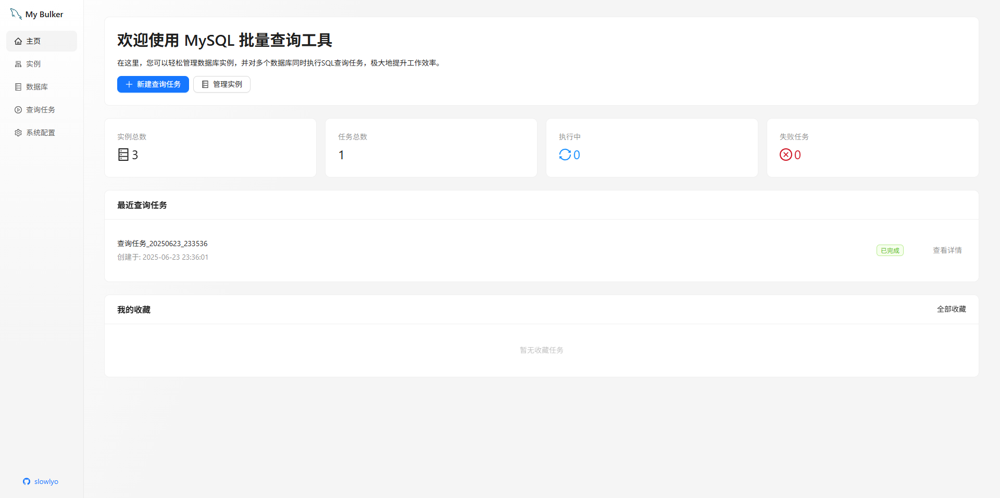
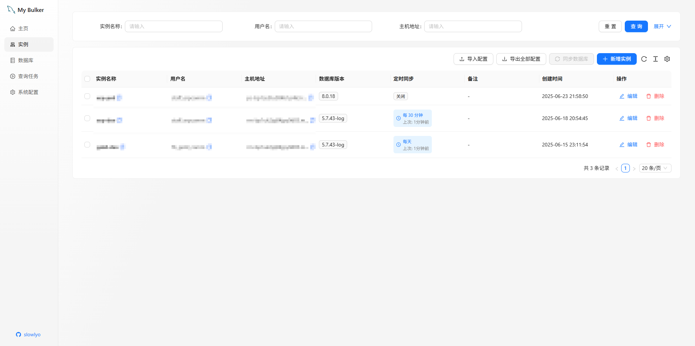
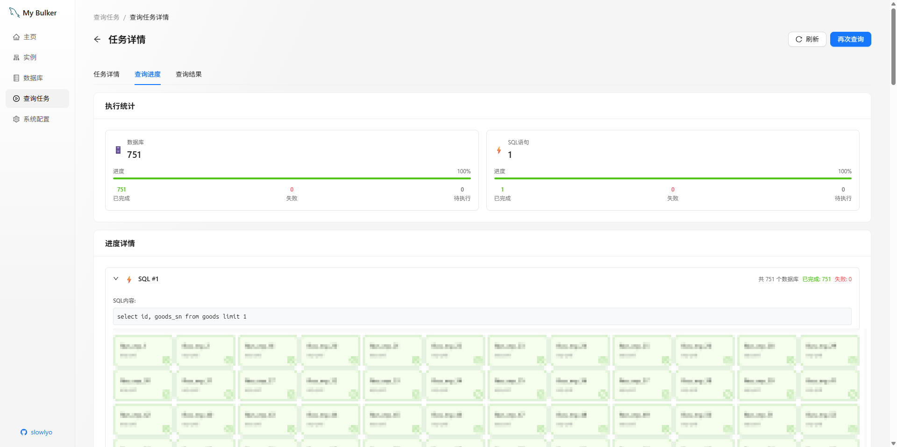
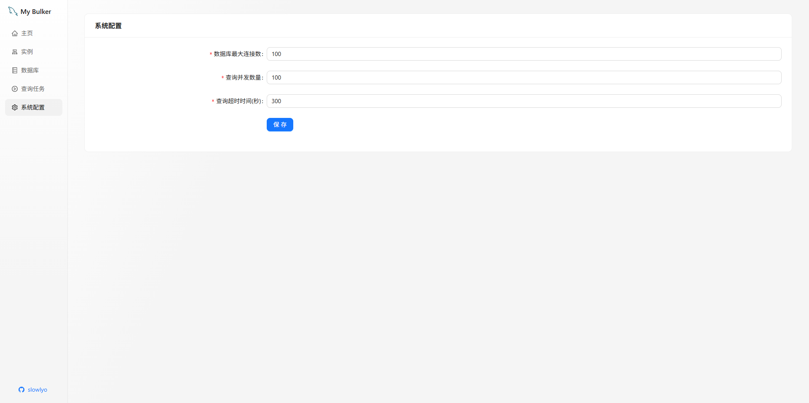

# My Bulker: 多数据库批量SQL执行与模式同步工具

`My Bulker` 是一个现代化的 Web 应用，旨在帮助开发者和数据库管理员轻松管理多个数据库实例，实现批量 SQL 执行和数据库模式的同步。

## ✨ 核心功能

- **多数据库实例管理**：在一个地方连接和管理所有数据库，支持 MySQL。
- **批量 SQL 执行**：一次向多个数据库或多个 schema 执行 SQL 查询。
- **历史与结果追溯**：保存每次的执行任务历史，方便回溯和审计。
- **配置导入与导出**：轻松备份和迁移您的数据库连接配置。
- **Web 化界面**：通过现代、直观的 Web UI 进行所有操作。

## 🚀 如何运行 (推荐使用 Docker)

本项目已完全容器化，您无需在本地安装 Go 或 Node.js 环境。

### 环境要求

- [Docker](https://www.docker.com/products/docker-desktop/)
- [Docker Compose](https://docs.docker.com/compose/install/)

### 启动步骤

1.  **克隆项目**:
    ```bash
    git clone https://github.com/slowlyo/my-bulker.git
    cd my-bulker
    ```

2.  **启动服务**:
    ```bash
    docker-compose up --build -d
    ```
    这个命令会：
    - 在后台构建并启动应用容器。
    - 第一次启动时会自动构建前端和后端，可能需要几分钟。

3.  **访问应用**:
    构建完成后，打开浏览器访问: **http://localhost:9092**

4.  **自定义端口**:
    如需使用不同端口（例如 `8080`），请在项目根目录创建一个 `.env` 文件，并添加以下内容：
    ```
    APP_PORT=8080
    PORT=8080
    ```
    然后重新执行 `docker-compose up --build -d`。

### 管理服务

- **停止服务**: `docker-compose down`
- **查看日志**: `docker-compose logs -f`

## 💻 手动部署 (使用发布包)

如果您不想使用 Docker，也可以直接从 GitHub Releases 下载预编译的程序。

1.  **下载**: 前往本项目的 [GitHub Releases](https://github.com/slowlyo/my-bulker/releases) 页面。
2.  **选择**: 根据您的操作系统和CPU架构，下载对应的压缩包（例如 `my-bulker-linux-amd64.tar.gz` 或 `my-bulker-windows-amd64.zip`）。
3.  **解压**: 将下载的压缩包解压到您选择的任意位置。
4.  **运行**:
    - **Linux/macOS**:
      ```bash
      # 授予执行权限
      chmod +x ./my-bulker
      # 运行 (可使用 --port 指定端口)
      ./my-bulker --port=8080
      ```
    - **Windows**:
      双击 `my-bulker.exe` 运行 (使用默认9092端口)。
      或通过命令行指定端口：
      ```bash
      my-bulker.exe --port=8080
      ```
5.  **访问应用**:
    程序启动后，打开浏览器访问: **http://localhost:PORT** (PORT为您指定的端口, 默认为9092)

> **数据存储说明**:
>
> 程序首次运行时，会在可执行文件所在的目录自动创建一个 `data` 文件夹，用于存放所有应用数据（包括 `app.db` 数据库文件）。请确保程序对该目录有写入权限。

## 🛠️ 技术栈

- **后端**: Go, Fiber (高性能 Web 框架)
- **前端**: UmiJS, Ant Design Pro, Tailwind CSS
- **数据库**: GORM (ORM), SQLite (默认元数据存储)

## 📸 应用预览




