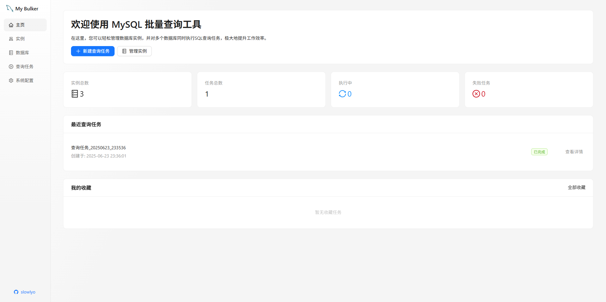
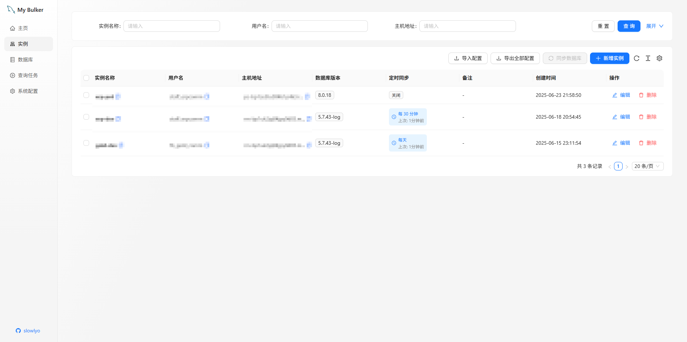
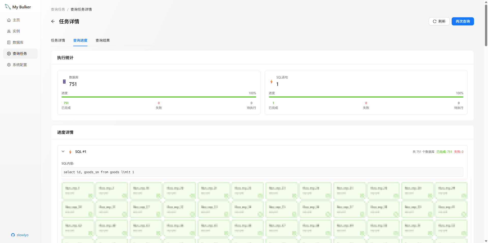
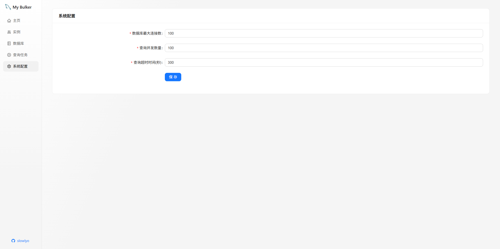

# My Bulker

`My Bulker` 是一个现代化的 Web 应用，旨在帮助开发者和数据库管理员轻松管理多个数据库实例，实现批量 SQL 执行。

## ✨ 核心功能

- **多数据库实例管理**：在一个地方连接和管理所有数据库，支持 MySQL。
- **批量 SQL 执行**：一次向多个数据库或多个 schema 执行 SQL 查询。
- **历史与结果追溯**：保存每次的执行任务历史，方便回溯和审计。
- **配置导入与导出**：轻松备份和迁移您的数据库连接配置。
- **Web 化界面**：通过现代、直观的 Web UI 进行所有操作。

## 🚀 如何运行 (推荐使用 Docker)

本项目已完全容器化，您无需在本地安装 Go 或 Node.js 环境。

### 环境要求

- [Docker](https://www.docker.com/products/docker-desktop/)
- [Docker Compose](https://docs.docker.com/compose/install/)

### 启动步骤

1.  **克隆项目**:
    ```bash
    git clone https://github.com/slowlyo/my-bulker.git
    cd my-bulker
    ```

2.  **启动服务**:
    ```bash
    docker-compose up --build -d
    ```
    这个命令会：
    - 在后台构建并启动应用容器。
    - 第一次启动时会自动构建前端和后端，可能需要几分钟。

3.  **访问应用**:
    构建完成后，打开浏览器访问: **http://localhost:9092**

4.  **自定义端口**:
    如需使用不同端口（例如 `8080`），请在项目根目录创建一个 `.env` 文件，并添加以下内容：
    ```
    APP_PORT=8080
    PORT=8080
    ```
    然后重新执行 `docker-compose up --build -d`。

### 管理服务

- **停止服务**: `docker-compose down`
- **查看日志**: `docker-compose logs -f`

## 💻 手动部署 (使用发布包)

如果您不想使用 Docker，也可以直接从 GitHub Releases 下载预编译的程序。

1.  **下载**: 前往本项目的 [GitHub Releases](https://github.com/slowlyo/my-bulker/releases) 页面。
2.  **选择**: 根据您的操作系统和CPU架构，下载对应的压缩包（例如 `my-bulker-linux-amd64.tar.gz` 或 `my-bulker-windows-amd64.zip`）。
3.  **解压**: 将下载的压缩包解压到您选择的任意位置。
4.  **运行**:
    - **Linux/macOS**:
      ```bash
      # 授予执行权限
      chmod +x ./my-bulker
      # 运行 (可使用 --port 指定端口)
      ./my-bulker --port=8080
      ```
    - **Windows**:
      双击 `my-bulker.exe` 运行 (使用默认9092端口)。
      或通过命令行指定端口：
      ```bash
      my-bulker.exe --port=8080
      ```
5.  **访问应用**:
    程序启动后，打开浏览器访问: **http://localhost:PORT** (PORT为您指定的端口, 默认为9092)

> **数据存储说明**:
>
> 程序首次运行时，会在可执行文件所在的目录自动创建一个 `data` 文件夹，用于存放所有应用数据（包括 `app.db` 数据库文件）。请确保程序对该目录有写入权限。

## 🖥️ 桌面端

Release 会额外上传 Wails 桌面包（文件名含 `desktop`），无需再手动打开浏览器。Web 服务端压缩包仍然保留。

1. 下载对应压缩包：
   - Windows：`my-bulker-desktop-windows-amd64.zip`
   - macOS：`my-bulker-desktop-darwin-universal.zip`（Intel / Apple Silicon）
   - Linux：`my-bulker-desktop-linux-amd64.tar.gz`
2. 解压后直接运行：
   - Windows：双击 `my-bulker-desktop.exe`（缺少 WebView2 时会使用内置引导安装）
   - macOS：打开 `my-bulker.app`
   - Linux：运行 `./my-bulker-desktop`，需已安装 `libgtk-3-0` 与 `libwebkit2gtk-4.1-0`
3. 数据目录：Windows / Linux 绿色包默认写在可执行文件旁的 `data/`；macOS `.app` 写在 `~/Library/Application Support/my-bulker/data/`。

macOS 应用目前未签名、未公证。若系统拦截，请先在 Finder 中右键 `my-bulker.app`，选择“打开”；若仍无法打开，请在终端执行：

```bash
xattr -dr com.apple.quarantine /path/to/my-bulker.app
chmod +x /path/to/my-bulker.app/Contents/MacOS/*
```

请将 `/path/to/my-bulker.app` 替换为实际路径。以上操作仅是未签名、未公证期间的权宜之计。

本地打包（需 [Wails CLI v2](https://wails.io)）：

```bash
go install github.com/wailsapp/wails/v2/cmd/wails@v2.12.0
# Linux 另需: sudo apt install libgtk-3-dev libwebkit2gtk-4.1-dev
APP_VERSION=v1.0.0 make build-desktop
# 产物在 build/bin/
```

日常开发仍用 Docker / `make dev`；桌面构建只用于出包。

## 版本更新

在「系统配置 → 版本更新」中可检查 GitHub Releases。稳定版本仅检查最新稳定版；当前版本为 beta 等预发布版本时，会同时比较稳定版和预发布版。

检测到更新后，应用会按桌面版/服务端、操作系统和 CPU 架构推荐对应压缩包并直接下载。没有完全匹配的资产时，界面会列出候选包并提供 GitHub Release 页面入口；应用不会自动覆盖安装。

## 🛠️ 技术栈

- **后端**: Go, Fiber (高性能 Web 框架)
- **前端**: UmiJS, Ant Design Pro, Tailwind CSS
- **桌面**: Wails v2（包装现有 Fiber + 前端产物）
- **数据库**: GORM (ORM), SQLite (默认元数据存储)

## 🛠️ 本地开发 (Hot Reload)

项目已配置 [Air](https://github.com/cosmtrek/air) 以支持 Go 后端的热重载。

1. **安装 Air**:
   ```bash
   go install github.com/air-verse/air@latest
   ```

2. **运行 Air**:
   在项目根目录下直接运行：
   ```bash
   air
   ```
   Air 会根据 `.air.toml` 自动编译并运行后端服务，并在代码修改后自动重新加载。

## 📸 应用预览





